# 🔐 Secure IoMT Data Transmission using Blockchain in Edge-Level Devices

<p align="center">
  
  
  
  
  
</p>


## 📜 Table of Contents
- [🚀 Overview](#overview)
- [🏗 Why Hyperledger Fabric?](#why-hyperledger-fabric)
  - [🔍 Comparison with Other Blockchain Platforms](#comparison-with-other-blockchain-platforms)
- [🗝️ Key Features](#key-features)
- [📂 Repository Structure](#repository-structure)
- [⚙️ System Architecture](#system-architecture)
- [🛠 Setup Guide](#setup-guide)
  - [1️⃣ ESP32 Setup](#1-esp32-setup)
  - [2️⃣ Blockchain Network Setup](#2-blockchain-network-setup)
  - [3️⃣ MQTT TLS Configuration](#3-mqtt-tls-configuration)
  - [4️⃣ Web Dashboard Setup](#4-web-dashboard-setup)
- [📊 Workflow](#workflow)
- [👥 Team Members](#team-members)
- [📄 License](#license)


## 📌 Overview
This project demonstrates **real-time, secure transmission of IoMT (Internet of Medical Things) data** from edge-level devices (ESP32, ESP8266) to a **Hyperledger Fabric blockchain network** using **TLS-secured MQTT** communication and AES encryption.  
We also built a **web-based live monitoring dashboard** to visualize SpO₂ and heart rate readings in real time.


## 🏗  Why Hyperledger Fabric?
We chose Hyperledger Fabric because it is a **permissioned blockchain** designed for enterprise-grade, secure, and high-throughput applications.
Unlike public blockchains such as Ethereum, Fabric allows fine-grained control over identity, data privacy, and network governance — making it ideal for IoT, supply chain, and business workflows where participants must be known and trusted.


### 🔍 Comparison with Other Blockchain Platforms
---
| Feature | Hyperledger Fabric | Ethereum | Other Public Blockchains |
|---------|-------------------|----------|--------------------------|
| **Type** | Permissioned (private) | Permissionless (public) | Mostly permissionless |
| **Consensus Mechanism** | Pluggable (e.g., Raft, Kafka, BFT) | Proof of Stake (PoS) / formerly PoW | Varies (PoS, PoW, etc.) |
| **Performance (TPS)** | High (1000+ TPS possible) | Lower (~15–45 TPS) | Varies (often <100 TPS) |
| **Smart Contracts** | Chaincode (Go, Java, Node.js) | Solidity (EVM-based) | Varies |
| **Privacy & Confidentiality** | Strong, with private channels | Public, all data visible | Generally public |
| **Governance** | Consortium-controlled | Community/miner voting | Community-controlled |
| **Transaction Cost** | No cryptocurrency required | Requires ETH gas fees | Requires native token fees |
| **Best For** | Enterprise, regulated industries, IoT, supply chain | Public dApps, DeFi, NFTs | Public apps, token projects |


### 💡 In short:
---
- Fabric = For controlled, trusted networks where privacy, performance, and governance matter most.

- Ethereum & others = For open, public participation where decentralization is more important than privacy.


## 🗝️ Key Features
- 🛡 **AES-128 Encryption** for sensor data before transmission
- 🔗 **Hyperledger Fabric** backend for tamper-proof storage
- 📡 **MQTT over TLS (port 8883)** for secure real-time data transfer
- 🗄 **CouchDB Integration** to query blockchain state
- 🌐 **Web Dashboard** to visualize live SpO₂ data with real-time updates
- ⚙ **Automated Bash Script** to deploy chaincode and push incoming MQTT data to the ledger


## 📂 Repository Structure
- **esp32_code/**
  - `esp32_secure.ino` — ESP32 firmware with AES encryption & MQTT TLS
- **bash_scripts/**
  - `start_network.sh` — Starts blockchain network & deploys chaincode
  - `mqtt_listener.sh` — Listens for MQTT messages & pushes to ledger
- **python_utils/**
  - `decrypt_aes.py` — AES decryption for incoming MQTT messages
- **web_dashboard/**
  - `babel.config.json` — Babel configuration for JSX/ESNext transpilation
  - `package.json / package-lock.json` — Node.js dependencies
  - `postcss.config.js` — PostCSS configuration for CSS processing
  - `tailwind.config.js` — TailwindCSS configuration
  - `server.jsx` — Backend server entry point for the dashboard
  - `public/` — Static assets served by the dashboard
  - `src/` — Source code for React/Tailwind UI components
  - `config/` — Configuration files (API endpoints, settings)
  - `models/` — Data models used by the dashboard backend
- `README.md` — Project documentation
- `prerequisites.md` — Project requirement documentation
- **`assets`** — Project Pictures
- **`LICENSE`** — Project LICENSE


## ⚙️ System Architecture

```mermaid
flowchart LR
    subgraph Device["Edge Device - ESP32/ESP8266"]
        Sensor["Health Sensor (SpO2, Heart Rate)"] --> AES["AES-128 Encryption"]
        AES --> TLS["TLS Layer"]
    end

    TLS --> MQTT["MQTT Broker (Mosquitto TLS 8883)"]
    MQTT --> Decrypt["Python AES Decryption Script"]
    Decrypt --> Fabric["Hyperledger Fabric Peer"]
    Fabric --> CouchDB[("CouchDB State Database")]

    CouchDB --> Dashboard["🌐 Live Monitoring Website"]
    CouchDB --> LedgerViewer["🔍 Blockchain Ledger Viewer"]

    classDef device fill:#ffecd1,stroke:#ff7f50,stroke-width:2px,color:#000;
    classDef backend fill:#e0f7fa,stroke:#00796b,stroke-width:2px,color:#000;
    class Sensor,AES,TLS device;
    class MQTT,Decrypt,Fabric,CouchDB backend;
```



## 🛠 Setup Guide

### 1️⃣ ESP32 Setup
1. Install [Arduino IDE](https://www.arduino.cc/en/software) & ESP32 board support.
2. Clone this repository and open `esp32_code/esp32_secure.ino`.
3. Update:
   ```bash
   const char* ssid = "YOUR_WIFI";
   const char* password = "YOUR_PASS";
   const char* mqtt_server = "BROKER_IP";
   const int mqtt_port = 8883; // TLS port
4. Place your TLS .crt and .key files in esp32_code/certs/ and load them in the code.
5. Upload code to your ESP32.

### 📟 Example ESP32 Serial Monitor Output
```plaintext
Connecting to WiFi...
WiFi connected
MQTT connected over TLS
Sending encrypted SpO₂: 98, Heart Rate: 76
Encrypted Payload: QWxhZGRpbjpvcGVuIHNlc2FtZQ==
Message published to topic: spo2/healthdata
```

> **⚠️ Note:** It is **highly recommended** to use a **Linux environment** (Ubuntu/Debian) for this setup, as Hyperledger Fabric and Docker services run more reliably on Linux.  
> Windows users should use **WSL2** or a **Linux virtual machine**.


### 2️⃣ Blockchain Network Setup

⚠️ ***Before continuing, make sure you have installed all dependencies listed in [prerequisites.md](prerequisites.md).***

1. Install [Hyperledger Fabric](https://hyperledger-fabric.readthedocs.io/en/latest/install.html).  
2. Place the modified chaincode inside your Fabric chaincode folder.  
3. Run the following commands in your terminal:
   ```bash
    # Install Hyperledger Fabric prerequisites:
    # https://hyperledger-fabric.readthedocs.io/en/latest/install.html

    # Navigate to scripts folder
    $ cd bash_scripts

    # Make the script executable
    $ chmod +x start_network.sh

    # Run the script to:
    # - Start Fabric network
    # - Deploy custom chaincode for SpO₂ data
    # - Start MQTT listener
    $ ./start_network.sh
4. This will:
    - Start the Fabric network
    - Deploy custom chaincode (for SpO₂ storage)
    - Start the MQTT listener
>**⚠️ NOTE:** Keep the bash script inside the test-network directory, otherwise paths will be different


### 📜 Example Blockchain Transaction Log
```plaintext
[INFO] New MQTT message received:
{
    "spo2": 98,
    "heartRate": 76,
    "timestamp": "2025-08-12T14:53:22Z"
}
[INFO] Transaction submitted to Fabric: txID=8e6a7e...
[INFO] CouchDB updated successfully.
```

### 🔐 TLS Certificates & Keys for MQTT over TLS
To enable secure communication between your ESP32, MQTT broker, and dashboard using TLS encryption, you must first generate the necessary certificates and keys.
>**Note:** This guide uses openssl. It’s recommended to run this in a Linux environment for compatibility.

#### 1️⃣ Create a Certificate Authority (CA)
```bash
# Generate private key for the CA
openssl genrsa -out ca.key 2048

# Generate the CA certificate
openssl req -x509 -new -nodes -key ca.key -sha256 -days 3650 -out ca.crt \
  -subj "/C=US/ST=State/L=City/O=Organization/OU=OrgUnit/CN=MQTT-CA"
```
---
#### 2️⃣ Generate the Server Certificate (for MQTT Broker)
```bash
# Generate the broker's private key
openssl genrsa -out server.key 2048

# Create a certificate signing request (CSR) for the broker
openssl req -new -key server.key -out server.csr \
  -subj "/C=US/ST=State/L=City/O=Organization/OU=OrgUnit/CN=broker.example.com"

# Sign the broker certificate with the CA
openssl x509 -req -in server.csr -CA ca.crt -CAkey ca.key -CAcreateserial \
  -out server.crt -days 365 -sha256
```
---
#### 3️⃣ Generate the Client Certificate (for ESP32 or Web App)
```bash
# Generate the client's private key
openssl genrsa -out client.key 2048

# Create a CSR for the client
openssl req -new -key client.key -out client.csr \
  -subj "/C=US/ST=State/L=City/O=Organization/OU=OrgUnit/CN=esp32-client"

# Sign the client certificate with the CA
openssl x509 -req -in client.csr -CA ca.crt -CAkey ca.key -CAcreateserial \
  -out client.crt -days 365 -sha256
```
---
#### 4️⃣ Files You Should Have Now
| File         | Purpose                                              |
| ------------ | ---------------------------------------------------- |
| `ca.key`     | Private key for the Certificate Authority            |
| `ca.crt`     | Public CA certificate (shared with broker & clients) |
| `server.key` | Private key for MQTT broker                          |
| `server.crt` | Public certificate for MQTT broker (signed by CA)    |
| `client.key` | Private key for MQTT client (ESP32/Web App)          |
| `client.crt` | Public certificate for MQTT client (signed by CA)    |
---

### 3️⃣ Configure MQTT Broker (Mosquitto) for TLS
```bash
# Place TLS certs in certs/ folder:
# certs/ca.crt
# certs/server.crt
# certs/server.key

# MQTT broker should run on port 8883 (TLS)
# All the certificates and keys should be owned by mosquitto
# Example with Mosquitto:
```
```bash
listener 8883
cafile /etc/mosquitto/certs/ca.crt
certfile /etc/mosquitto/certs/server.crt
keyfile /etc/mosquitto/certs/server.key
require_certificate true
use_identity_as_username true
```
***Restart Mosquitto after changes:***
```bash
sudo systemctl restart mosquitto
```


### 4️⃣ Web Dashboard Setup
```bash
# Navigate to the dashboard folder
$ cd web_dashboard

# Install dependencies
$ npm install

# Start the development server
$ npm run dev

# The dashboard will be available at:
# http://localhost:3000
```


## 🌐 Dashboard Data Flow

1. **Data Collection:**  
   Edge devices (ESP32/ESP8266) collect health data such as SpO₂ and heart rate, encrypt it, and send it securely over MQTT to the broker.

2. **Blockchain Storage:**  
   Hyperledger Fabric stores the data immutably on the ledger. CouchDB acts as the state database that maintains the latest key-value state for efficient querying.

3. **Backend API:**  
   The Express.js backend queries CouchDB through REST calls to fetch the latest sensor data and alerts.  
   **⚠️ Note:** In `server.js`, make sure to replace the CouchDB URL (`DB_URL`) with your server’s actual IP address so the backend can connect properly.

4. **Frontend Visualization:**  
   The web dashboard periodically fetches data from the backend API endpoints and renders it as live charts and alerts for real-time monitoring.

5. **Real-Time Updates:**  
   The dashboard refreshes the data regularly, providing doctors and monitoring staff with up-to-date vital signs and alerts to facilitate timely intervention.

### 📊 Live Monitoring Dashboard
<figure>
  
  <figcaption>Figure 1: Live Monitoring Dashboard Screenshot</figcaption>
  
  <figcaption>Figure 2: Live Monitoring of Heart Rate</figcaption>
  
  <figcaption>Figure 3: Live Monitoring of SpO2 Rate</figcaption>
  
  <figcaption>Figure 4: Live Monitoring of History</figcaption>
  
  <figcaption>Figure 4: Live Monitoring of Alert Triggers</figcaption>
</figure>


## 📊 Workflow
### 1. Data Collection on Edge Devices
The ESP32 or ESP8266 continuously reads health parameters like SpO₂ and heart rate from connected sensors.

### 2. Encryption for Security
To protect patient data, the device encrypts the sensor readings using AES-128 encryption and then encodes the encrypted data in Base64 format for safe transmission.

### 3. Secure Data Transmission
The encrypted data is sent securely over MQTT using TLS encryption to an MQTT broker running on port 8883, ensuring the communication channel is safe from eavesdropping.

### 4. Data Reception and Decryption
On the server side, a script listens to incoming MQTT messages. It decrypts the data back into readable sensor values using a Python AES decryption script.

### 5. Blockchain Storage
The decrypted data is then stored on the Hyperledger Fabric blockchain ledger. This ensures the health data is tamper-proof, auditable, and trustworthy.

### 6. State Database Update
The blockchain’s state database, CouchDB, holds the latest snapshot of all sensor data, allowing quick access and queries without interacting directly with the blockchain ledger.

### 7. Real-Time Visualization
The web dashboard fetches live data from CouchDB and displays it as real-time charts and alerts, giving healthcare providers instant insight into patient vitals.

### 8. Alert Mechanism
Critical conditions, such as low oxygen levels or high heart rates, trigger alerts that can be seen on the dashboard to prompt immediate attention.


---
## 👥 Team Members
- **Amartya Roy** – Blockchain Network & Integration
- **Hrishikesh Kumar Chaudhary** – IoT Device Programming & Security
- **Madhu Singh** – Backend & CouchDB Integration
- **Anshika** – Web Dashboard & Frontend Development


---
## 📄 License
***This project is licensed under the Apache License 2.0 - see the [LICENSE](LICENSE) file for details.***

